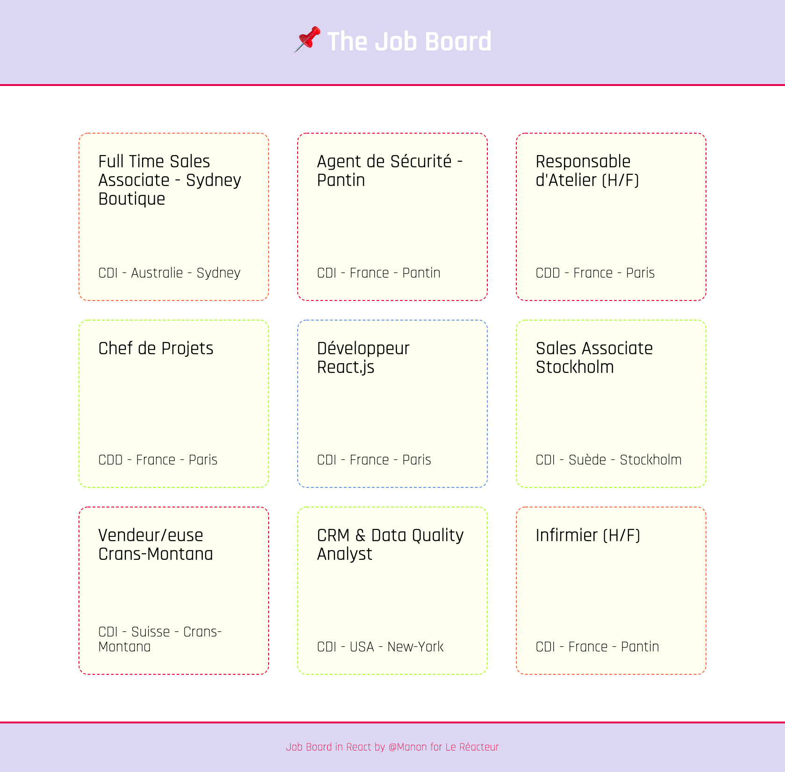

# job-board-LeReacteur

🗓 April 2021.  
🪄 Frontend with ♥️ React - job board.

## Welcome in my school exercice (job board) 📌

### My work?

To familiarize with the framework React.js. First project, first meeting with React.js 🤗 The difficulty was to cut the code into several components, so as to have a reusable and cleaner code.

## Languages

HTML5, CSS3 & React.js.

See you on the next React.js projects!

🙏🏻 Thank you @LeReacteur.
